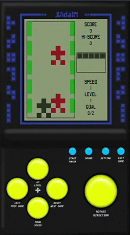

<h1 align="center">
  Versão JavaScript(JS) do Clássico Jogo de Carro do Mini Game "Brick Game".
</h1>

<h3 align="center">
  <a href="README.md">Versão em Inglês</a>
</h3>

<h4 align="center">
  Este é meu primeiro jogo em JS, criado para praticar minha habilidades.
</h4>

  
  
  
  
  
  
  
  
  
   

  <a href="#black_nib-passos-da-criação">Passos da Criação</a>&nbsp;&nbsp;&nbsp;|&nbsp;&nbsp;&nbsp;
  <a href="#blue_book-regras-do-jogo">Regras do Jogo</a>&nbsp;&nbsp;&nbsp;|&nbsp;&nbsp;&nbsp;
  <a href="#rocket-tecnologias-e-recursos">Tecnologias e Recursos</a>&nbsp;&nbsp;&nbsp;|&nbsp;&nbsp;&nbsp;
  <a href="#memo-licença">Licença</a>

  

<h3 align="center">
  
</h3>

## :black_nib: Passos da Criação

- Área do Jogo
  - [x] Criar o carro principal
  - [x] Criar as paredes
  - [x] Criar os carros rivais
  - [x] Criar os movimentos de:
    - [x] Carro Principal
    - [x] Paredes
    - [x] Carros Rivais
  - [x] Criar movimentos randomicos dos carros rivais
  - [x] Criar área não utrapassável
  - [x] Criar colisão
- Área de status:
  - [x] Criar Pontuação
  - [x] Criar Maior Pontuação
  - [x] Criar Objetivo
  - [x] Criar Vida
  - [x] Criar Nível
  - [x] Criar Velocidade
  - [x] Exibir/Atualizar Status
- Outros
  - [ ] Criar animação de colisão
  - [ ] Criar botão para mover por Mobile
  - [ ] Salvar maior pontuação
  - [x] Incluir plano de fundo
  - [ ] Incluir áudios
  - [ ] Tela de Fim de Jogo:
    - [ ] Pontuação
    - [ ] Maior Pontuação

## :blue_book: Regras do Jogo

- Vida:
  - Inicia com 5 vidas.
  - Cada colisão com um carro rival perde 1 vida.
  - Após 5 vidas perdidas, reinicia pontuação, nível, velocidade e objetivo.
- Maior Pontuação - Pontos máximos alcançados.
- Objetivo:
  - Ganha 1 ponto por carro ultrapassado.
  - Limite de 25 pontos.
- Nível - Aumenta 1 nível a cada 2x de aumento na velocidade.
- Velocidade - Aumenta em 1x a cada 25 pontos alcançados do Objetivo.
- Pontuação:
  - Nível 1 e Velocidade 1: 50 pontos por carro ultrapassado.
  - Nível 1 e Velocidade 2: 75 pontos por carro ultrapassado.
  - Nível 2 e Velocidade 3: 100 pontos por carro ultrapassado.
  - Nível 2 e Velocidade 4: 125 pontos por carro ultrapassado.
  - Nível 3 e Velocidade 5: 150 pontos por carro ultrapassado.
  - Nível 3 e Velocidade 6: 175 pontos por carro ultrapassado.

## :rocket: Tecnologias e Recursos

- [ECMAScript][es]
- [VS Code][vc] com [EditorConfig][vceditconfig] e [ESLint][vceslint]

Utilizei os recursos do ECMAScript: `Use Strict`, `String Interpolation`, `Variáveis Const e Let`. Além disso, utilizei alguns padrões de projeto, como: `Factory`, `Injeção de Dependência`, `Observer`, `Command` etc.

## :memo: Licença

Este projeto está sob a licença do MIT. Veja a [LICENÇA](https://github.com/jvidaln/jvidaln.github.io/blob/master/LICENSE) para mais informações.

---

Feito com ♥ por Jean Vidal :wave: [Entre em contato!](https://www.linkedin.com/in/jvidalnunes/)

[vc]: https://code.visualstudio.com/
[vceditconfig]: https://marketplace.visualstudio.com/items?itemName=EditorConfig.EditorConfig
[vceslint]: https://marketplace.visualstudio.com/items?itemName=dbaeumer.vscode-eslint
[es]: https://www.ecma-international.org/
