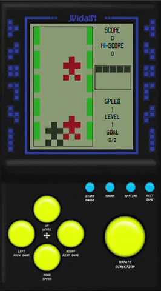

<h1 align="center">
  JavaScript(JS) Version Of The Classic Brick Game Car Racing.
</h1>

<h3 align="center">
  <a href="README-ptBR.md">Portuguese version</a>
</h3>

<h4 align="center">
  This is my first game in JS, created to pratice my skill.
</h4>

  
  
  
  
  
  
  
  
  
   

  <a href="#black_nib-creation-steps">Creation Steps</a>&nbsp;&nbsp;&nbsp;|&nbsp;&nbsp;&nbsp;
  <a href="#blue_book-game-rules">Game Rules</a>&nbsp;&nbsp;&nbsp;|&nbsp;&nbsp;&nbsp;
  <a href="#rocket-technologies-and-features">Technologies and Features</a>&nbsp;&nbsp;&nbsp;|&nbsp;&nbsp;&nbsp;
  <a href="#memo-license">License</a>

  

<h3 align="center">
  
</h3>

## :black_nib: Creation Steps

- Game Area
  - [x] Create the main car
  - [x] Create the bricks
  - [x] Create the rival cars
  - [x] Create the movements of:
    - [x] Main car
    - [x] Bricks
    - [x] Rival cars
  - [x] Create random moves from rival cars
  - [x] Create non-passable area
  - [x] Create collision
- Status Area
  - [x] Create Score
  - [x] Create Hi-Score
  - [x] Create Life
  - [x] Create Level
  - [x] Create Speed
  - [x] Create Goal
  - [x] Show/Update Status
- Others
  - [x] Restart game after collision
  - [x] Restart the game and reset the status after the game is over
  - [ ] Create collision animation
  - [x] Include swipe events to move by Mobile
  - [ ] Save Hi-Score
  - [x] Include background
  - [ ] Include sounds
  - [ ] Game over screen:
    - [ ] Score
    - [ ] Hi-Score

## :blue_book: Game Rules

- Life:
  - Start with 5 lives.
  - Each collision with a rival car loses 1 life.
  - After 5 lives lost, reset score, level, speed and goal.
- Hi-Score - Maximum points reached.
- Goal:
  - Ganha 1 point per car overtaken.
  - 25 points limit.
- Level - Increases 1 level for every 2x speed increase.
- Speed ​​- Increases by 1x for every 25 points achieved from the Goal.
- Score:
  - Level 1 and Speed 1: 50 points per car overtaken.
  - Level 1 and Speed 2: 75 points per car overtaken.
  - Level 2 and Speed 3: 100 points per car overtaken.
  - Level 2 and Speed 4: 125 points per car overtaken.
  - Level 3 and Speed 5: 150 points per car overtaken.

## :rocket: Technologies and Features

- [ECMAScript][es]
- [VS Code][vc] with [EditorConfig][vceditconfig] and [ESLint][vceslint]

I used features of ECMAScript: `Use Strict`, `String Interpolation`, `Const and Let Variables`. In addition, some design patterns were used, such as `Factory`, `Dependency Injection`, `Observer`, `Command`.

## :memo: License

This project is under the MIT license. See the [LICENSE](https://github.com/jvidaln/brick-game-car-racing/blob/master/LICENSE) for more information.

---

Made with ♥ by Jean Vidal :wave: [Get in touch!](https://www.linkedin.com/in/jvidalnunes/)

[vc]: https://code.visualstudio.com/
[vceditconfig]: https://marketplace.visualstudio.com/items?itemName=EditorConfig.EditorConfig
[vceslint]: https://marketplace.visualstudio.com/items?itemName=dbaeumer.vscode-eslint
[es]: https://www.ecma-international.org/
